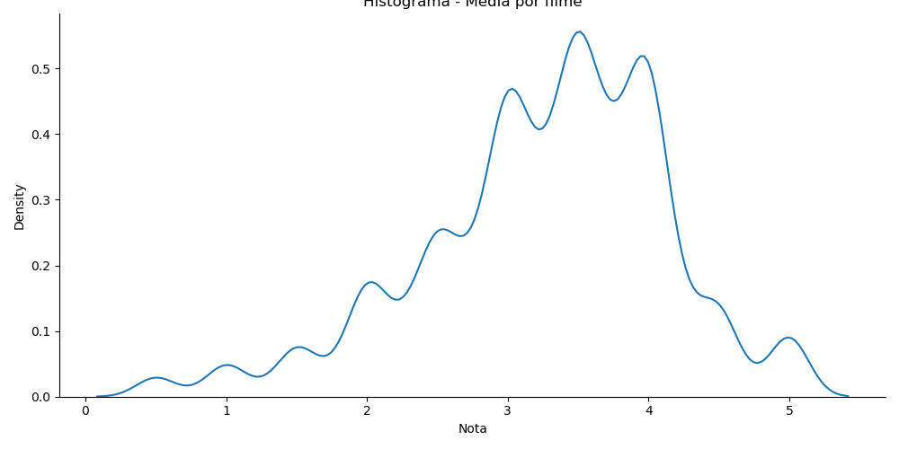

# Descrição do projeto

Análise de notas e idiomas de filmes, de uma base de dados. O intuito desse projeto é definir qual o filme melhor avaliado pelos usuários, além de definir qual idioma está mais presente na produção de filmes. 

## Base de dados
A primeira base de dados utilizada, está disponível no site do Kaggle: https://www.kaggle.com/datasets/tmdb/tmdb-movie-metadata

Nome: tmdb_5000_movies

Essa base de dados possui 4803 filmes cadastrados, e os respectivos atributos:

| **Atributos** | **Descrição** |
| ------------------- | ------------------- |
| Orçamento | Valor gasto para a produção do filme |
| Gênero | Gênero do filme (Ação, comédia, suspense, etc) |
| Site | Endereço do site da produção do filme |
| Identificador | Número de identificação do filme |
| Palavras-chaves | Palavras importantes que representam o filme |
| Idioma | Idioma original do filme |
| Título | Nome do filme |
| Sinopse | Resumo do filme |
| Popularidade | Escala de popularidade do filme |
| Produtora | Empresa que produziu o filme |
| País de produção | Origem onde foi produzido o filme |
| Data de lançamento | Data de lançamento o filme |
| Receita | Receita produzida pelo filme |
| Tempo de duração | Duração do filme |
| Dublagens | Idiomas em que o filme foi dublado |
| Status | Lançado ou em produção |
| Slogan | Frase de efeito do filme |
| Título | Nome do filme |
| Nota | Nota do filme |
| Contagem | Quantidade de avaliações que o filme recebeu |

A segunda e a terceira base de dados, foi disponibilizada pela Alura: https://www.alura.com.br

Nome: movies

Uma base de dados de filmes, com 9742 obras cadastradas e os respectivos atributos:

| **Atributos** | **Descrição** |
| ------------------- | ------------------- |
| Id | Número de identificação do filme |
| Título | Nome do filme |
| Gênero | Gênero do filme (ção, comédia, suspense, etc) |

E uma relacionado a avaliações de filmes, com 100836 registros e os seguintes atributos:

Nome: ratings

| **Atributos** | **Descrição** |
| ------------------- | ------------------- |
| Usuário | Número de identificação do usuário |
| Filme | Número do filme |
| Nota | Nota atribuida ao filme |
| Momento | Marca temporal (Momento em que o filme foi lançado) |

## Tratamento de dados

Originalmente, a base de dados está em inglês. Para melhor compreensão, o primeiro passo foi a tradução dos registros e das colunas. 
Não há dados nulos (NA).
Para a base de dados "ratings", referente as avaliações dos filmes, o número de identificação dos filmes foi substituído pelo nome do filme, com auxílio da base de dados "movies".

## Análise dos idiomas originais

Há filmes com 37 idiomas diferentes na base de dados, desde inglês até pashto.

Como esperado, o idioma mais frequente é o inglês, com 4505 filmes dos 4803 presentes na base de dados, o que corresponde a 93,79% dos filmes. Os Estados Unidos são lideres no mercado da sétima arte, devido a isso, há essa discrepância entre eles e a França, que estão em segundo lugar. 

Os franceses possuem 70 filmes na base de dados, o que corresponde a apenas 1,45%. 

O cinema, foi inventado pelos irmãos Auguste e Louis Lumiere em 1895, em Lyon, na França, por isso o país se encontra na segunda colocação.

### Análise gráfica

Produzindo gráficos com esses dados, fica claro o domínio americano no mundo cinematográfico. Comparando o idioma inglês, com todos os outros somados, temos um gráfico de pizza:

A presença do idioma inglês é 15 vezes maior do que todos os outros idiomas somados. Com um gráfico em barras essa disparidade fica mais evidente ainda:

### Análise de outros idiomas

Realizando uma análise no restante dos idiomas, excluindo o inglês, é possível observar a superioridade do francês em relação aos idiomas restantes, tendo o dobro da frequência do segundo colocado, o espanhol. Em terceiro, há o mandarin, enquanto o português aparece em 11°, atrás de idiomas como russo e coreano, mostrando que a industria cinematográfica lusofônica não é tão relevante no cenário mundial, apesar de alguns filmes terem concorrido ao Oscar. 

O gráfico a seguir apresenta a frequência de cada idioma presente na base de dados:

## Análise notas

Algo a se atentar em uma análise de notas de avaliação, é a quantidade de avaliações. Por exemplo nesta base de dados, os filmes, Stiff Upper Lips, Dancer, Texas Pop. 81, Me You and Five Bucks, e Little Big Top possuem a maior nota média de 10.0 com uma soma de votos entre eles de 5 votos, ou seja, cada um dos filmes recebeu apenas uma avaliação cada. É impossível afirmar que a nota do filme é de fato 10 na visão dos usuários, pois essa é uma avaliação específica de uma pessoa.

Já o filme The Shawshank Redemption possui 8205 votos e uma nota média de 8.5, sendo esse de fato, o filme mais bem avaliado.

O filme com a pior avaliação média, é o longa-metragem 2012, com 4903 notas atribuídas e média de 5.6.

## Análise da base de dados "ratings"

As notas presentes nesse banco de dados estão no intervalo de 0 a 5. 

A média das notas de todos os filmes é de 3.5, a mediana apresenta o mesmo valor, 3.5. Já a nota com a maior frequência, a moda, é a nota 4.0. Com essas informações, é esperado que o gráfico de distribuição de frequências, apresente um comportamento assimétrico a esquerda, pois a moda é maior que a média e a mediana.

O gráfico abaixo, demonstra esse comportamento:

A maioria das avaliações atribuídas aos filmes pelos usuários, estão acima da média.

### Análise da média de notas por filme

Assim como na base de dados tmdb, as notas estão em um intervalo de 0 a 5

Para essa base de dados, a nota média dos filmes é de 3.26, a mediana 3.42, e a moda 4.0. O comportamento da curva esperada é de assimetria a esquerda, pois a média é menor que a mediana, que é menor que a moda, assim como na base de dados analisada anteriormente. O gráfico a seguir apresenta esse comportamento:

Um forma diferente de observar esse comportamento, é por meio de um gráfico boxplot. É perceptível a assimetra a esquerda, assim como a presença de alguns Outliers. A maior parte das notas está concentrada entre 3.0 e 4.0, o que indica uma alta qualidade os filmes.

Por fim, um gráfico do tipo histograma, para reforçar o comportamento da distribuição dos dados:

### Comparando os filmes "Toy Story" e "Jumanji"

Realizando uma análise de comparação entre dois filmes, "Toy Story" e "Jumanji", com a finalidade de definir, de acordo com os usuários, qual o melhor filme entre os selecionados.

Toy Story obteve 232 avaliações, enquanto Jumanji apenas 29. Em relação as medidas centrais, a nota média foi de 4.37 e 3.95, a mediana 5.0 e 4.0, assim como a moda, para Toy Story e Jumanji respectivamente. Os dois gráficos abaixo, apresentam a distribuição de frequência das notas de cada um dos filmes:

É possivel observar que, o gráfico referente ao filme Toy Story, possui assimetria a esquerda. Fica evidente que a nota máxima 5, foi a mais frequente, o que indica a otima qualidade do filme. Em relação ao filme Jumanji, a curva se comporta aproximadamente como uma distribuição normal, com uma leve assimetria a esquerda. A nota 4 foi a mais frequente, o que confere uma boa qualidade ao filme, porém menor em relação ao Toy Story.

Com auxílio do gráfico boxplot, a diferença na distribuição de frequência das notas entre os dois filmes fica mais evidente:

Com esse gráfico, fica evidente a superioridade do filme Toy Story, em relação ao filme Jumanji. Basicamente, 75 % das pessoas que assistiram o filme, avaliaram com nota 4, enquanto apenas 50%, deram a mesma nota, para o filme Jumanji. 

É possivel perceber a existência de Outliers, para Toy Story, e não para o filme Jumanji. Esses outliers, podem ter sido gerados por um mecanismo distinto, ou até mesmo por um conjunto de pessoas, que por algum motivo específico, avaliam com nota baixa, em forma de protesto ou retaliação, algo muito comum na industria cinematográfica. Ambos os filmes possuem, praticamente o mesmo desvio padrão.

# Conclusão

Para a primeira base de dados analisada, o idioma com o maior número de filmes produzidos é o inglês, com quase 94% dos filmes presentes no banco de dados. Em segundo lugar, vem o francês, responsável por apenas 1,5% dos longa-metragem. A industria luso-fônica possui pouco impacto na cinematográfia mundial, sendo responsável por apenas 0.2% das produções.

Analisando as avaliações atribuidas pelos usuários, o filme The Shawshank Redemption, obteve a maior média, com nota 8.5, com mais de 8000 votos. A pior classificação, fica com o longa "2012", com nota média de 5.6 com quase 5000 avaliações.

Filmes como Stiff Upper Lips, Dancer, Texas Pop. 81, Me You and Five Bucks, e Little Big Top, apresentam nota média de 10.0, porém com baixíssima quantidade de votos.

Na comparação entre os filmes Toy Story e Jumanji, a animação se destaca sobre o longa de aventura, com uma nota média de 4.4, contra 4.0 da produção dirigida por Jake Kasdan e Joe Johnston.
