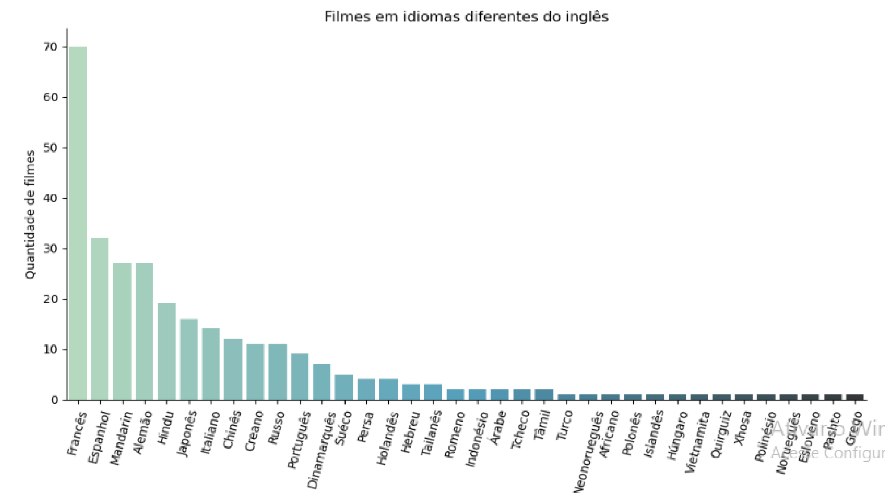

# Descrição do projeto

Análise de notas e idiomas de filmes, de uma base de dados. O intuito desse projeto é definir qual o filme melhor avaliado pelos usuários, além de definir qual idioma está mais presente na produção de filmes. 

## Base de dados
A base de dados utilizada, está disponível no site do Kaggle: https://www.kaggle.com/datasets/tmdb/tmdb-movie-metadata

Essa base de dados possui 4803 filmes cadastrados, e os respectivos atributos:

| **Atributos** | **Descrição** |
| ------------------- | ------------------- |
| Orçamento | Valor gasto para a produção do filme |
| Gênero | Gênero do filme (Ação, comédia, suspense, etc) |
| Site | Endereço do site da produção do filme |
| Identificador | Número de identificação do filme |
| Palavras-chaves | Palavras importantes que representam o filme |
| Idioma | Idioma original do filme |
| Título | Nome do filme |
| Sinopse | Resumo do filme |
| Popularidade | Escala de popularidade do filme |
| Produtora | Empresa que produziu o filme |
| País de produção | Origem onde foi produzido o filme |
| Data de lançamento | Data de lançamento o filme |
| Receita | Receita produzida pelo filme |
| Tempo de duração | Duração do filme |
| Dublagens | Idiomas em que o filme foi dublado |
| Status | Lançado ou em produção |
| Slogan | Frase de efeito do filme |
| Título | Nome do filme |
| Nota | Nota do filme |
| Contagem | Quantidade de avaliações que o filme recebeu |

## Tratamento de dados

Originalmente, a base de dados está em inglês. Para melhor compreensão, o primeiro passo foi a tradução dos registros e das colunas. 
Não há dados nulos (NA).

## Análise dos idiomas originais

Há filmes com 37 idiomas diferentes na base de dados, desde inglês até pashto.
Como esperado, o idioma mais frequente é o inglês, com 4505 filmes dos 4803 presentes na base de dados, o que corresponde a 93,79% dos filmes. Os Estados Unidos são lideres no mercado da sétima arte, devido a isso, há essa discrepância entre eles e a França, que estão em segundo lugar. 
Os franceses possuem 70 filmes na base de dados, o que corresponde a apenas 1,45%. 
O cinema, foi inventado pelos irmãos Auguste e Louis Lumiere em 1895, em Lyon, na França, por isso o país se encontra na segunda colocação.

### Análise gráfica

Produzindo gráficos com esses dados, fica claro o domínio americano no mundo cinematográfico. Comparando o idioma inglês, com todos os outros somados, temos um gráfico de pizza:

A presença do idioma inglês é 15 vezes maior do que todos os outros idiomas somados. Com um gráfico em barras essa disparidade fica mais evidente ainda:

### Análise de outros idiomas

Realizando uma análise no restante dos idiomas, excluindo o inglês, é possível observar a influência do francês em relação aos idiomas restantes, tendo o dobro da frequência do segundo colocado, o espanhol. Em terceiro, há o mandarin, enquanto o português aparece em 11°, atrás de idiomas como russo e coreano, mostrando que a industria cinematográfica lusofônica não é tão relevante no cenário mundial, apesar de alguns filmes terem concorrido ao Oscar. O gráfico a seguir apresenta a frequência de cada idioma presente na base de dados:

